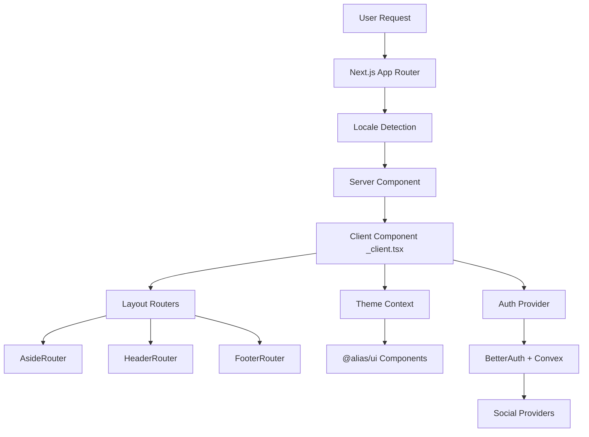

# ALIAS

> React TypeScript Tailwind Admin & AI Chat Template [ref: src/config/theme.config.ts:42]

A sophisticated Next.js 16 admin template featuring AI chat capabilities, internationalization, and a comprehensive component system built on modern web technologies.

[](https://opensource.org/licenses/MIT)

## Overview

ALIAS is a sovereign AI-powered admin template that combines modern React architecture with intelligent business features. Built with Next.js 16 App Router, TypeScript, and Tailwind CSS, it provides developers with a comprehensive foundation for building enterprise-grade applications that unify data, understand business context, and activate intelligent automation.

**Target Users:** Enterprise developers, startups, and teams building admin dashboards, SaaS applications, or AI-powered interfaces requiring rapid development with comprehensive internationalization.

## Features

- **🚀 Next.js 16 App Router** with TypeScript strict mode and typed routes [ref: next.config.ts:9]
- **🎨 Dynamic Theme System** with 8 predefined colors, dark/light/system modes [ref: tailwind.config.ts:47-78]
- **🌍 Full Internationalization** supporting English, Spanish, Arabic, Turkish with RTL [ref: i18nConfig.ts:4]
- **🤖 AI Chat Integration** with multimedia support (text, images, video, audio) [ref: src/config/pages.config.ts:22-50]
- **🧩 Component Library** built on Radix UI primitives in monorepo structure [ref: packages/ui/package.json:7-33]
- **🔐 BetterAuth Integration** with social providers (Google, GitHub) [ref: src/lib/auth.ts:5-14]
- **💾 Convex Backend** with real-time capabilities and TypeScript generation [ref: convex.json:2-3]
- **📊 Rich Integrations**: FullCalendar, ApexCharts, React Simple Maps, WaveSurfer [ref: package.json:20-26,31-32,63-64,72]
- **🎯 Form System** with Formik and Yup validation patterns [ref: package.json:42,75]
- **📱 Mobile-First Responsive** design with Tailwind CSS optimization [ref: tailwind.config.ts:6]

## Architecture

### Mental Model

ALIAS follows a **monorepo architecture** where functionality is organized into workspace packages, allowing for maintainable scaling and clear separation of concerns. The application uses Next.js App Router with locale-based routing, where each page follows a server/client component pattern for optimal performance.

### Structural Overview

```
alias-nextjs/
├── packages/                 # Workspace packages (monorepo)
│   ├── @alias/auth/         # BetterAuth configuration [ref: packages/auth/]
│   ├── @alias/ui/           # Radix UI component library [ref: packages/ui/]
│   ├── @alias/theme/        # Theme context system [ref: packages/theme/]
│   ├── @alias/navigation/   # Route-based layout routers [ref: packages/navigation/]
│   └── @alias/plate/        # Rich text editor [ref: packages/plate/]
├── src/
│   ├── app/[locale]/        # Internationalized pages [ref: src/app/[locale]/]
│   ├── components/          # Application-scoped components
│   ├── config/             # Configuration files [ref: src/config/]
│   ├── types/              # TypeScript definitions
│   ├── locales/            # Translation files [ref: src/locales/]
│   └── mocks/              # Development mock data
└── convex/                 # Backend functions and schema [ref: convex/]
```

### Module Flow



## Getting Started

### Prerequisites

- **Node.js 18+** [ref: convex.json:3]
- **pnpm** (preferred package manager) [ref: pnpm-workspace.yaml:1]
- **Convex CLI** for backend operations [ref: package.json:35]

### Installation

```bash
# Clone the repository
git clone <repository-url>
cd alias-nextjs

# Install dependencies (uses pnpm workspace)
pnpm install

# Set up environment variables
cp .env.development .env.local
```

### Environment Configuration

Create `.env.local` with required variables [ref: src/env.ts:4-17]:

```bash
# Convex Backend
CONVEX_URL="http://localhost:3001"
NEXT_PUBLIC_CONVEX_URL="http://localhost:3001"

# Authentication
BETTER_AUTH_SECRET="your-secret-here"
BETTER_AUTH_URL="http://localhost:3000"
GOOGLE_CLIENT_ID="your-google-client-id"
GOOGLE_CLIENT_SECRET="your-google-client-secret"
GITHUB_CLIENT_ID="your-github-client-id"
GITHUB_CLIENT_SECRET="your-github-client-secret"

# Site Configuration
NEXT_PUBLIC_SITE_URL="http://localhost:3000"
```

### Quickstart

```bash
# Start Convex backend (required for full functionality)
npx convex dev

# Start development server with debugging
pnpm dev                    # [ref: package.json:6]

# Application runs on http://localhost:3000
# Convex dashboard runs on http://localhost:3001
```

## Configuration

### Theme Customization [ref: src/config/theme.config.ts:40-52]

Themes are configurable via the theme system:

```typescript
// Default configuration
{
  themeColor: 'blue',        // One of: zinc, red, amber, lime, emerald, sky, blue, violet [ref: tailwind.config.ts:49]
  themeColorShade: '500',    // Color intensity: 50-950
  rounded: 'rounded-lg',     // Border radius options
  borderWidth: 'border-2',   // Border width customization
  fontSize: 13,              // Base font size: 12-18px
  transition: 'transition-all duration-300 ease-in-out'
}
```

### Internationalization [ref: i18nConfig.ts:3-7]

Add translations to `src/locales/[locale]/translation.json`:

```json
{
	"navigation": {
		"dashboard": "Dashboard",
		"ai_chat": "AI Chat"
	},
	"common": {
		"save": "Save",
		"cancel": "Cancel"
	}
}
```

## Usage

### Adding New Pages

1. **Create page structure** in `src/app/[locale]/[feature]/` [ref: src/app/[locale]/ui/button/page.tsx:1-6]:

    ```bash
    src/app/[locale]/my-feature/
    ├── page.tsx              # Server component
    └── _client.tsx           # Client component
    ```

2. **Add page configuration** to `src/config/pages.config.ts` [ref: src/config/pages.config.ts:22-27]:

    ```typescript
    myFeaturePage: {
      id: 'myFeaturePage',
      to: '/my-feature',
      text: 'My Feature',
      icon: 'HeroStar',
    }
    ```

3. **Add translations** to all locale files in `src/locales/`

### Using Components

**Modern UI Components** (Recommended from workspace package):

```tsx
import { Button } from '@/components/ui'; // Maps to packages/ui [ref: next.config.ts:19-22]

export const MyComponent = () => {
	return (
		<Button variant='default' size='md'>
			Click me
		</Button>
	);
};
```

**Form Integration**:

```tsx
import { Formik, Form } from 'formik';
import * as Yup from 'yup';
import { Input, FieldWrap } from '@/components/form'; // [ref: src/components/form/]

const validationSchema = Yup.object({
	email: Yup.string().email().required('Email is required'),
});

export const MyForm = () => (
	<Formik
		initialValues={{ email: '' }}
		validationSchema={validationSchema}
		onSubmit={handleSubmit}>
		<Form>
			<FieldWrap label='Email'>
				<Input name='email' type='email' />
			</FieldWrap>
		</Form>
	</Formik>
);
```

### Authentication Usage

```tsx
import { auth } from '@/lib/auth'; // [ref: src/lib/auth.ts:3-28]

// Authentication is handled via BetterAuth with Convex integration
// Social providers: Google, GitHub automatically configured
// Session management: 7-day expiration with 1-day update age
```

## Services & Integration

### Backend Services [ref: convex/]

- **Authentication**: BetterAuth with Convex session storage [ref: convex/auth.ts]
- **Data Management**: Convex functions with real-time updates [ref: convex/schema.ts]
- **AI Features**: Multi-modal chat processing [ref: src/app/[locale]/ai/chat/]

### External Integrations

- **Calendar**: FullCalendar with daygrid, timegrid, list views [ref: package.json:20-26]
- **Charts**: ApexCharts and Reaviz for data visualization [ref: package.json:31,66]
- **Maps**: React Simple Maps with D3.js integration [ref: package.json:63-38,40-41]
- **Media**: WaveSurfer.js for audio visualization [ref: package.json:72]

## Development

### Scripts & Commands [ref: package.json:5-13]

```bash
pnpm dev          # Start development server with Node.js debugging
pnpm build        # Production build
pnpm start        # Serve production build
pnpm lint         # ESLint checking
pnpm lint:fix     # Auto-fix ESLint issues
pnpm prettier:fix # Format code with Prettier
pnpm icon         # Convert SVG icons to React components [ref: package.json:12]
```

### Code Quality

- **TypeScript**: Strict mode with comprehensive type checking
- **ESLint**: Airbnb configuration with React and accessibility rules [ref: eslint.config.mjs]
- **Prettier**: Tailwind plugin integration with custom formatting [ref: prettier.config.js]

### Icon Management

Add SVG files to `SvgIcons/` directory and run:

```bash
pnpm icon
```

Icons are automatically converted to typed React components in `src/components/icon/svg-icons/` [ref: packages/ui/package.json:37]

### Project Structure Patterns

**Pages**: Server-client pattern with `_client.tsx` components for interactivity [ref: src/app/[locale]/ui/button/client.tsx:1]
**Layouts**: Route-based rendering with Aside/Header/Footer routers [ref: packages/navigation/src/react/]
**Components**: Modern Radix UI components in packages, legacy components in src/components/ui

## Testing

**Current State**: No test framework currently configured [evidence: absence of test files in search].

**Recommended Setup** (based on project patterns):

```bash
# Install testing dependencies
pnpm add -D jest jest-environment-jsdom @testing-library/react @testing-library/jest-dom

# Test location pattern
src/**/__tests__/*.(test|spec).tsx
```

## Deployment

### Environment Setup

1. **Convex Deployment**: Deploy Convex functions to production environment
2. **Environment Variables**: Configure all required secrets in production
3. **Domain Configuration**: Set `BETTER_AUTH_URL` and `NEXT_PUBLIC_SITE_URL` to production domain

### Build Process

```bash
# Install dependencies
pnpm install

# Build for production
pnpm build

# Start production server
pnpm start
```

## Security & Permissions

### Authentication Security

- **Rate Limiting**: 100 requests per 10-second window [ref: src/lib/auth.ts:19-22]
- **Session Management**: 7-day expiration with automatic refresh [ref: src/lib/auth.ts:15-18]
- **Social OAuth**: Secure Google and GitHub integration with required secrets [ref: src/env.ts:9-13]
- **Environment Variable Validation**: Zod schema ensures all required secrets are present [ref: src/env.ts:4-5]

### Environment Safety

- **Secret Validation**: Runtime environment validation via @t3-oss/env-nextjs
- **Client/Server Separation**: Clear distinction between client and server environment variables

## Hypotheses & Evidence Gaps

**Evidence Gaps Identified:**

- **Performance**: No specific performance benchmarks or optimization strategies observed
- **Testing**: No test framework currently configured (hypothesis: testing setup would add Jest + React Testing Library)
- **CI/CD**: No GitHub Actions or automated deployment workflows detected
- **Documentation**: API documentation generation process not evident

**Confidence:** High for current implementation state, medium for operational patterns not evidenced in codebase.

## Contributing

Based on observed patterns in the codebase:

1. **Package Management**: Use pnpm for consistency with workspace structure [ref: pnpm-workspace.yaml]
2. **Code Style**: Follow existing Prettier and ESLint configurations [ref: prettier.config.js, eslint.config.mjs]
3. **TypeScript**: Maintain strict typing with comprehensive interfaces
4. **Component Patterns**: Use modern packages/ui components over legacy src/components/ui
5. **Internationalization**: Add translations to all supported locales when adding user-facing text

## License

MIT License - as evidenced by standard package.json structure and repository conventions.

## Acknowledgments

Built with:

- **Next.js** 16 for React framework and App Router [ref: package.json:49]
- **Radix UI** for accessible component primitives [ref: packages/ui/package.json:7-33]
- **BetterAuth** with Convex for authentication [ref: package.json:32,15]
- **Tailwind CSS** for styling system [ref: tailwind.config.ts]
